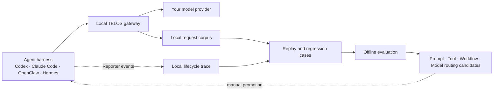

<div align="center">


### Your context. Your evidence. Your agent gets better.

**Own long-running agent context locally, replay real work, and turn production traces into offline improvements.**

<sub>🔒 Local-first &nbsp;·&nbsp; 🔌 Harness-agnostic &nbsp;·&nbsp; ⏪ Replayable &nbsp;·&nbsp; 🧬 Built for continuous evolution</sub>

<br/>

[](LICENSE)
[](pyproject.toml)
[](CHANGELOG.md)
[](CHANGELOG.md)

[**Quickstart**](#quickstart) &nbsp;·&nbsp; [**How it works**](#how-it-works) &nbsp;·&nbsp; [**What ships today**](#what-ships-today) &nbsp;·&nbsp; [**Design**](docs/adr/0001-local-trace-and-task-type-evolution.md)

**📖 English** &nbsp;|&nbsp; [🇨🇳 中文](README.zh-CN.md)

</div>

---

## From an agent gateway to an agent learning system

Agents can work for hours, but their operating context is still rented from a harness, scattered across opaque logs, and discarded when the task ends. Failures get fixed once and then rediscovered. Useful production experience rarely becomes a regression case, an evaluation, or training data.

TELOS is a local control plane between agent harnesses and models. Its goal is to make long-running agent context:

- **Private** — persisted under your control, with no TELOS cloud telemetry.
- **Portable** — independent of a single harness or model provider.
- **Replayable** — production work can become reproducible task samples.
- **Evolvable** — outcomes can feed offline evaluation of prompts, tools, workflows, and model routing.

Prompt-cache optimization remains part of TELOS. It is now one runtime primitive inside a larger system: **keep the context, learn from the work, improve the next attempt.**

<a id="how-it-works"></a>

## How it works



TELOS keeps two complementary records:

1. The **gateway corpus** stores model requests for deterministic replay and cost comparison.
2. The **Harness Reporter trace** stores lifecycle events the model API cannot see: attempts, tool results, approvals, workspace changes, artifacts, feedback, and final outcomes.

They are correlated by `session_id` and become one task history without forcing existing replay data into a new format.

<a id="what-ships-today"></a>

## What ships today

| Capability | Status |
|---|---|
| Inject the local gateway into Codex, Claude Code, OpenClaw, and Hermes | **Available** |
| Record model-request corpus locally and replay sessions across modes | **Available** |
| Authenticated Reporter endpoint and append-only local event store | **Available** |
| `telos evolve --task` task-type policy with offline evaluation and manual promotion settings | **Available** |
| Native Reporter hooks that capture every tool/approval/workspace event from each harness | **Next** |
| Automatic outcome labeling, failure attribution, regression generation, and candidate evaluation | **Next** |
| SFT/RL dataset export | **Planned** |

The current `evolve` command configures the evolution policy. It does **not** yet run an evaluator worker or modify production agent behavior.

<a id="quickstart"></a>

## Quickstart

```bash
# Install (Linux / macOS / WSL2 / Android Termux)
curl -fsSL https://raw.githubusercontent.com/learningCatHD/telos-sdk/main/scripts/install.sh | bash
# Or: uv pip install -U telos-sdk

# Connect one harness. Future Codex processes route through the local gateway.
telos init --harness codex

# Opt a task type into the offline-evolution policy.
telos evolve --task "code defect repair"

# Inspect harness injection, gateway state, and traffic forwarding.
telos status
```

Start a new harness process after `telos init`; already-running processes do not retroactively reload their provider configuration.

For savings and traffic visibility:

```bash
telos dashboard
```

## Private and portable by default

TELOS persists its state under `~/.telos/`:

| Path | Contents |
|---|---|
| `config.json` | Gateway, harness Trace, and evolution policies; includes local Reporter tokens |
| `corpus/` | Raw model requests used for replay |
| `traces/<harness>/` | Append-only Reporter event streams |
| `usage.jsonl` | Token usage and cost metrics |

These files can contain prompts, source code, tool results, and credentials present in model requests. Protect the directory as sensitive data. TELOS does not upload it to a TELOS service, but your configured model provider still receives the requests needed for inference.

To migrate, stop the gateway, securely copy the complete `~/.telos/` directory, and start TELOS on the destination. No hosted control plane or proprietary database is required.

## Trace model

TELOS uses a small hierarchy that matches how agent work actually happens:

```text
TaskType  →  TaskRun  →  Attempt  →  Event
```

- **TaskType**: a reusable class of work, such as `code defect repair`.
- **TaskRun**: one concrete task with its inputs and acceptance criteria.
- **Attempt**: one agent execution under a specific prompt/tool/workflow/model configuration.
- **Event**: an ordered fact observed during the attempt.

Hook adapters can report lifecycle events through the CLI without handling Reporter credentials directly:

```bash
telos report \
  --harness codex \
  --session task-123 \
  --event tool.finished \
  --data '{"tool":"pytest","exit_code":1}'
```

The store assigns monotonic sequence numbers, deduplicates `event_id`, and writes one local JSONL stream per harness session.

## The self-evolution contract

The target loop is deliberately offline and evidence-gated:

```text
production trace
  → outcome label and failure attribution
  → frozen regression case
  → one-axis candidate revision
  → paired offline evaluation
  → recommendation
  → human promotion
```

A candidate may change a prompt, tool policy, workflow, or model route—but not all of them at once. Private rubrics remain outside the candidate-generation context, and passing candidates are recommended rather than silently deployed.

The full decision, including alternatives and phase boundaries, lives in [ADR-0001: Local Trace and task-type evolution](docs/adr/0001-local-trace-and-task-type-evolution.md).

## Context and cost optimization

TELOS still canonicalizes agent context into a stable IR and arranges it for provider KV-cache reuse. On the existing six-turn OpenClaw measurement, cost fell from `$0.3623` to `$0.0281` (`−92.3%`); SWE-bench Verified measured `−52.8%` new input and `−40.5%` end-to-end cost without a statistically significant resolved-rate regression.

See the [protocol](https://docs.telosai.pro/en/concepts/protocol), [benchmark methodology](https://docs.telosai.pro/en/benchmark/swebench), and [support matrix](https://docs.telosai.pro/en/reference/support-matrix).

## Documentation

| Topic | Reference |
|---|---|
| Local Trace and evolution decision | [ADR-0001](docs/adr/0001-local-trace-and-task-type-evolution.md) |
| Current implementation architecture | [docs/ARCHITECTURE.md](docs/ARCHITECTURE.md) |
| Installation and integration | [docs.telosai.pro](https://docs.telosai.pro/en/start/installation) |
| Release history | [CHANGELOG.md](CHANGELOG.md) |

## Contributing and license

Issues and pull requests are welcome. Run the test suite with:

```bash
pytest
```

TELOS core is licensed under [Apache 2.0](LICENSE).

## Citation

```bibtex
@misc{wang2026telos-agent,
  title        = {Telos: A Cost-Aware Inference Infrastructure for AI Agent},
  author       = {Zheng Wang, Shenzhi Wang, HongTao Zhong, Shiji Song, Gao Huang},
  howpublished = {\url{https://github.com/learningCatHD/telos-sdk.git}},
  year         = {2026}
}
```

<div align="center">

**Keep the context. Learn from the work. Improve the next attempt.**

</div>
