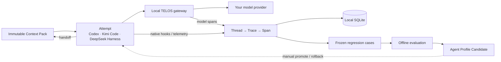

<div align="center">


### Your context. Your evidence. Your agent gets better.

**Own long-running agent context locally, replay real work, and turn production traces into offline improvements.**

<sub>💰 Up to 90% token-bill savings &nbsp;·&nbsp; 🔒 Local-first &nbsp;·&nbsp; 🔌 Harness-agnostic &nbsp;·&nbsp; ⏪ Replayable &nbsp;·&nbsp; 🧬 Built for continuous evolution</sub>

<br/>

[](LICENSE)
[](pyproject.toml)
[](CHANGELOG.md)
[](CHANGELOG.md)

[**Quickstart**](#quickstart) &nbsp;·&nbsp; [**How it works**](#how-it-works) &nbsp;·&nbsp; [**Savings**](#cost-optimization) &nbsp;·&nbsp; [**What ships today**](#what-ships-today) &nbsp;·&nbsp; [**Context design**](docs/adr/0003-portable-context-pack-and-self-evolution.md)

**📖 English** &nbsp;|&nbsp; [🇨🇳 中文](README.zh-CN.md)

</div>

---

## From an agent gateway to an agent learning system

Agents can work for hours, but their operating context is still rented from a harness, scattered across opaque logs, and discarded when the task ends. Failures get fixed once and then rediscovered. Useful production experience rarely becomes a regression case, an evaluation, or training data.

TELOS is a local control plane between agent harnesses and models. Its goal is to make long-running agent context:

- **Private** — persisted under your control, with no TELOS cloud telemetry.
- **Portable** — independent of a single harness or model provider.
- **Replayable** — production work can become reproducible task samples.
- **Evolvable** — outcomes can feed offline evaluation of prompts, tools, workflows, and model routing.

Prompt-cache optimization remains part of TELOS. It is now one runtime primitive inside a larger system: **keep the context, learn from the work, improve the next attempt.**

<a id="how-it-works"></a>

## How it works



An ordinary Conversation may create a compatibility `TaskRun`, but only an explicit `Task → TaskExecution → Attempt` owns durable Goal, State, `agent.md`, Knowledge and Skills. Each Execution freezes those revisions; Trace trees remain evidence rather than trusted State. Open `http://127.0.0.1:7171/` for Conversations, Long Tasks, the Wiki knowledge graph and evaluations, or `.../traces` for raw evidence.

<a id="what-ships-today"></a>

## What ships today

| Capability | Status |
|---|---|
| Inject the local gateway into Codex, Claude Code, OpenClaw, and Hermes | **Available** |
| Replay SQLite LLM spans across modes; optional legacy corpus compatibility | **Available** |
| SQLite Trace/Span store, authenticated batch ingest, and local Trace Explorer | **Available** |
| Native Codex, Kimi Code, and DeepSeek Harness tracing adapters | **Available** |
| Deterministic Context Pack, `.telosbundle`, secret/path/checksum validation | **Available** |
| Codex ↔ Kimi handoff with explicit capability degradation and Attempt lineage | **Available** |
| Context/Runs/Evolution/Evidence local control plane | **Available** |
| Explicit Long Tasks, audited State revisions, Wiki injection, and local knowledge graph | **Available** |
| Frozen private/public cases, recursive evidence-driven Candidates, repeated cross-Harness gates, promote/rollback | **Available** |
| SFT, preference, and RL JSONL export | **Available** |

Evaluation is explicit and offline: `telos evolve run --rounds N --runs N` executes isolated frozen matrices and retains only strict improvements. TELOS never promotes a Candidate automatically; `promote` and `rollback` alone move the audited production pointer.

<a id="quickstart"></a>

## Quickstart

```bash
# Install (Linux / macOS / WSL2 / Android Termux)
curl -fsSL https://raw.githubusercontent.com/learningCatHD/telos-sdk/main/scripts/install.sh | bash
# Or: uv pip install -U telos-sdk

# Connect Harness adapters and start the local gateway.
telos init --harness codex
telos init --harness kimi-code

# Create one TaskRun and enter Codex with an explicit Attempt identity.
telos run start --task code-defect-repair --goal "fix persistent tabs" --harness codex

# From that session, checkpoint and continue in Kimi Code.
telos pack --done "reproduced" --next "patch refresh" --decision "selection is UI state"
telos handoff kimi-code --pack <pack-id>

# Inspect harness injection, gateway state, and traffic forwarding.
telos status
```

Start a new harness process after `telos init`; already-running processes do not retroactively reload their provider configuration.

Open the Context Control Plane; token savings remains a separate view:

```bash
telos dashboard
telos dashboard --savings
```

## Private and portable by default

TELOS persists its state under `~/.telos/`:

| Path | Contents |
|---|---|
| `config.json` | Gateway, Harness Trace, and evolution policies; includes per-Harness tracing tokens |
| `control.token` | mode `0600` write token for local control-plane mutations |
| `packs/` | immutable Context Pack directories |
| `profiles/` | immutable Agent Profile Revision directories |
| `runs/` | temporary, TELOS-owned handoff Launch Plans |
| `corpus/` | Optional legacy raw-request corpus (`--record-corpus` only) |
| `telos.db` | SQLite TaskRuns, Attempts, packs, profiles, evaluations, traces, spans, and feedback |
| `usage.jsonl` | Token usage and cost metrics |

These files can contain prompts, source code, tool results, and credentials present in model requests. Protect the directory as sensitive data. TELOS does not upload it to a TELOS service, but your configured model provider still receives the requests needed for inference.

To migrate, stop the gateway, securely copy the complete `~/.telos/` directory, and start TELOS on the destination. No hosted control plane or proprietary database is required.

## Trace model

TELOS uses the same compact hierarchy across Harnesses:

```text
Project  →  Thread  →  Trace  →  Span
```

- **Project**: a local logical grouping.
- **Thread**: one Harness session or conversation.
- **Trace**: one user turn or agent attempt.
- **Span**: one agent, LLM, tool, approval, or compaction operation.

Install the adapters, then inspect the unified tree locally:

```bash
telos init --harness codex
telos init --harness kimi-code
telos init --harness deepseek-harness --replace-telemetry-backend
# http://127.0.0.1:7171/traces
```

If another program named `dsh` appears first on `PATH`, point TELOS at the
actual DeepSeek Harness CLI. For a built source checkout:

```bash
telos init --harness deepseek-harness --replace-telemetry-backend \
  --dsh-executable /path/to/deepseek-harness/apps/cli/lib/bin.js
```

Adapters generate stable IDs and submit idempotent entity snapshots; the Gateway is the only SQLite writer. Codex installation uses its native plugin manager when available and falls back to a non-destructive `hooks.json` merge on older clients.

Kimi Code integration adds fail-open lifecycle hooks without changing managed OAuth providers. API-key providers also route through the Gateway for model spans. Uninstall removes only TELOS hooks and restores any routed provider URL.

## The self-evolution contract

The target loop is deliberately offline and evidence-gated:

```text
production trace
  → outcome label and failure attribution
  → frozen regression case
  → one-axis candidate revision
  → paired offline evaluation
  → recommendation
  → human promotion
```

A candidate may change a prompt, tool policy, workflow, or model route—but not all of them at once. Private rubrics remain outside the candidate-generation context, and passing candidates are recommended rather than silently deployed.

The tracing decision, including alternatives and phase boundaries, lives in [ADR-0002: Trace/Span agent tracing platform](docs/adr/0002-opik-style-agent-tracing-platform.md).

<a id="cost-optimization"></a>

## Context and cost optimization

Prompt-cache optimization remains part of TELOS: no prompt rewrite or compression is required. TELOS canonicalizes agent context into a stable IR and arranges it for provider KV-cache reuse.

In an existing real six-turn OpenClaw measurement:

| Mode | Raw input tokens | Cache read | Six-turn cost |
|---|---:|---:|---:|
| Passthrough | 24,151 | 0 | **$0.3623** |
| TELOS | 0 | 18,701 | **$0.0281 (−92.3%)** |

SWE-bench Verified measured `−52.8%` new input and `−40.5%` end-to-end cost. The A/B resolved-rate comparison found no statistically significant regression (McNemar `p = 0.66`). Savings vary with workload and provider cache pricing; `telos dashboard --savings` reports the absolute cost for your own traffic.

See the [protocol](https://docs.telosai.pro/en/concepts/protocol), [benchmark methodology](https://docs.telosai.pro/en/benchmark/swebench), and [support matrix](https://docs.telosai.pro/en/reference/support-matrix).

## Documentation

| Topic | Reference |
|---|---|
| Local Trace and evolution decision | [ADR-0001](docs/adr/0001-local-trace-and-task-type-evolution.md) |
| Current implementation architecture | [docs/ARCHITECTURE.md](docs/ARCHITECTURE.md) |
| Installation and integration | [docs.telosai.pro](https://docs.telosai.pro/en/start/installation) |
| Release history | [CHANGELOG.md](CHANGELOG.md) |

## Contributing and license

Issues and pull requests are welcome. Run the test suite with:

```bash
pytest
```

TELOS core is licensed under [Apache 2.0](LICENSE).

## Citation

```bibtex
@misc{wang2026telos-agent,
  title        = {Telos: A Cost-Aware Inference Infrastructure for AI Agent},
  author       = {Zheng Wang, Shenzhi Wang, HongTao Zhong, Shiji Song, Gao Huang},
  howpublished = {\url{https://github.com/learningCatHD/telos-sdk.git}},
  year         = {2026}
}
```

<div align="center">

**Keep the context. Learn from the work. Improve the next attempt.**

</div>
