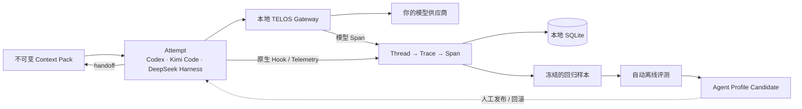

<div align="center">


### 上下文归你，经验留下，Agent 持续变好

**将长任务上下文私有化，把真实生产轨迹变成可回放样本与离线进化证据。**

<sub>💰 Token 账单最高节省约 90% &nbsp;·&nbsp; 🔒 本地优先 &nbsp;·&nbsp; 🔌 Harness 无关 &nbsp;·&nbsp; ⏪ 可回放 &nbsp;·&nbsp; 🧬 为持续进化而生</sub>

<br/>

[](LICENSE)
[](pyproject.toml)
[](CHANGELOG.md)
[](CHANGELOG.md)

[**快速开始**](#quickstart) &nbsp;·&nbsp; [**工作原理**](#how-it-works) &nbsp;·&nbsp; [**节省效果**](#cost-optimization) &nbsp;·&nbsp; [**当前能力**](#what-ships-today) &nbsp;·&nbsp; [**上下文设计**](docs/adr/0003-portable-context-pack-and-self-evolution.md)

[📖 English](README.md) &nbsp;|&nbsp; **🇨🇳 简体中文**

</div>

---

## 从 Agent 网关到 Agent 学习系统

Agent 已经可以连续工作数小时，但它的运行上下文仍寄存在某个 Harness 中，散落在不透明的日志里，并随任务结束而丢失。同一种失败会反复修复，真实生产经验很少能沉淀为回归样本、离线评测或训练数据。

TELOS 是位于 Agent Harness 与模型之间的本地控制面。它的目标是让长任务上下文：

- **私有**：持久化在你控制的本地环境中，没有 TELOS 云端遥测。
- **可迁移**：不被某个 Harness 或模型供应商绑定。
- **可回放**：真实生产任务可以转化为可复现样本。
- **可进化**：结果证据可以驱动 Prompt、Tool、Workflow 和模型路由的离线评测。

Prompt Cache 优化仍然是 TELOS 的底层能力，但它现在服务于更完整的目标：**留下上下文，从工作中学习，让下一次执行更好。**

<a id="how-it-works"></a>

## 工作原理



普通 Conversation 可以产生兼容用的 `TaskRun`，但只有用户显式创建的 `Task → TaskExecution → Attempt` 才持有长期 Goal、State、`agent.md`、Knowledge 和 Skills。每次 Execution 冻结实际使用的 revision；Trace 树只作为证据，不能直接充当可信 State。`http://127.0.0.1:7171/` 提供 Conversations、Long Tasks、Wiki 知识图谱和评测，原始证据位于 `.../traces`。

<a id="what-ships-today"></a>

## 当前能力

| 能力 | 状态 |
|---|---|
| 为 Codex、Claude Code、OpenClaw 和 Hermes 注入本地 Gateway | **已可用** |
| 从 SQLite LLM Span 跨模式回放；兼容可选旧 corpus | **已可用** |
| SQLite Trace/Span 存储、带鉴权的 batch ingest 与本地 Trace Explorer | **已可用** |
| Codex、Kimi Code 与 DeepSeek Harness 原生 tracing adapter | **已可用** |
| 确定性 Context Pack、`.telosbundle`、secret/path/checksum 校验 | **已可用** |
| Codex ↔ Kimi handoff、显式能力降级与 Attempt 谱系 | **已可用** |
| Context/Runs/Evolution/Evidence 本地控制面 | **已可用** |
| 显式 Long Task、审计 State revision、Wiki 注入与本地知识图谱 | **已可用** |
| 公私隔离的冻结样本、递归证据驱动 Candidate、多次跨 Harness 质量门、发布与回滚 | **已可用** |
| SFT、Preference 与 RL JSONL 导出 | **已可用** |

评测只在用户显式触发时离线执行；`telos evolve run --rounds N --runs N` 在隔离工作区执行冻结矩阵，只保留严格提升的 Candidate。TELOS 永不自动发布 Candidate，只有 `promote` 与 `rollback` 能移动有审计记录的 production pointer。

<a id="quickstart"></a>

## 快速开始

```bash
# 安装（Linux / macOS / WSL2 / Android Termux）
curl -fsSL https://raw.githubusercontent.com/learningCatHD/telos-sdk/main/scripts/install.sh | bash
# 或：uv pip install -U telos-sdk

# 接入 Harness adapter 并启动本地 Gateway。
telos init --harness codex
telos init --harness kimi-code

# 创建 TaskRun，并带明确 Attempt 身份进入 Codex。
telos run start --task code-defect-repair --goal "修复 tab 状态" --harness codex

# 在该 Session 中打包，再切到 Kimi Code。
telos pack --done "已复现" --next "修复轮询刷新" --decision "选择态属于 UI"
telos handoff kimi-code --pack <pack-id>

# 查看 Harness 注入、Gateway 和流量转发状态。
telos status
```

执行 `telos init` 后请启动一个新的 Harness 进程；已经运行的进程不会追溯加载新的模型供应商配置。

打开 Context Control Plane；Token Savings 保留为独立视图：

```bash
telos dashboard
telos dashboard --savings
```

## 默认私有、随时迁移

TELOS 将状态持久化到 `~/.telos/`：

| 路径 | 内容 |
|---|---|
| `config.json` | Gateway、Harness Trace 和进化策略；包含各 Harness 的 tracing token |
| `control.token` | 权限为 `0600` 的本地控制面写入 token |
| `packs/` | 不可变 Context Pack 目录 |
| `profiles/` | 不可变 Agent Profile Revision 目录 |
| `runs/` | TELOS 自有的临时 handoff Launch Plan |
| `corpus/` | 可选旧版原始请求 corpus（仅 `--record-corpus`） |
| `telos.db` | SQLite TaskRun、Attempt、Pack、Profile、Evaluation、Trace、Span 与 feedback |
| `usage.jsonl` | Token 用量与成本指标 |

这些文件可能包含 Prompt、源代码、工具结果，以及模型请求中出现的凭据，应按敏感数据保护。TELOS 不会把它们上传到 TELOS 服务，但你配置的模型供应商仍会收到完成推理所需的请求。

迁移时，停止 Gateway，安全复制完整的 `~/.telos/` 目录，再在目标设备启动 TELOS 即可；不依赖托管控制面或专有数据库。

## Trace 数据模型

TELOS 在不同 Harness 间使用同一套最小层级：

```text
Project  →  Thread  →  Trace  →  Span
```

- **Project**：本地逻辑分组。
- **Thread**：一次 Harness Session 或对话。
- **Trace**：一次用户 turn 或 Agent attempt。
- **Span**：一次 Agent、LLM、Tool、Approval 或 Compaction 操作。

安装 adapter 后，即可在本地查看统一 Trace 树：

```bash
telos init --harness codex
telos init --harness kimi-code
telos init --harness deepseek-harness --replace-telemetry-backend
# http://127.0.0.1:7171/traces
```

如果 `PATH` 中优先出现的是另一个同名 `dsh`，请显式指定真正的 DeepSeek Harness CLI。
对于已经构建的源码 checkout：

```bash
telos init --harness deepseek-harness --replace-telemetry-backend \
  --dsh-executable /path/to/deepseek-harness/apps/cli/lib/bin.js
```

Adapter 生成稳定 ID 并提交幂等实体快照；Gateway 是唯一的 SQLite writer。Codex 安装优先使用原生 plugin manager，旧客户端才回退到不破坏用户配置的 `hooks.json` 合并。

Kimi Code 适配会追加 fail-open 生命周期 hooks，且不修改托管 OAuth provider。API Key provider 还会经 Gateway 记录模型 span。卸载只移除 TELOS hooks，并恢复曾被代理的 provider URL。

## 自我进化契约

目标闭环默认离线运行，并以证据为门槛：

```text
生产 Trace
  → 结果标签与失败归因
  → 冻结的回归样本
  → 单变量候选改动
  → 配对离线评测
  → 优化建议
  → 人工发布
```

每个候选方案只改变 Prompt、Tool 策略、Workflow 或模型路由中的一项，避免多个变量同时变化而无法归因。私有评测标准不会进入候选生成上下文；通过评测的候选只会被推荐，不会静默发布到生产环境。

Tracing 的完整取舍、替代方案与阶段边界见 [ADR-0002：基于 Trace/Span 的 Agent Tracing 平台](docs/adr/0002-opik-style-agent-tracing-platform.md)。

<a id="cost-optimization"></a>

## 上下文与成本优化仍然存在

Prompt Cache 优化仍然是 TELOS 的底层能力，无需重写或压缩 Prompt。TELOS 会把 Agent 上下文规范化为稳定 IR，并为模型供应商的 KV Cache 复用进行排列。

在既有的一次真实 OpenClaw 六轮实测中：

| 模式 | Raw input tokens | Cache read | 六轮总成本 |
|---|---:|---:|---:|
| Passthrough | 24,151 | 0 | **$0.3623** |
| TELOS | 0 | 18,701 | **$0.0281（−92.3%）** |

SWE-bench Verified 测得 new input `−52.8%`、端到端成本 `−40.5%`。A/B 解决率对比未发现统计显著回归（McNemar `p = 0.66`）。实际节省取决于工作负载和模型供应商的缓存计价；可用 `telos dashboard --savings` 查看自身流量的绝对成本。

详见[协议](https://docs.telosai.pro/zh/concepts/protocol)、[Benchmark 方法](https://docs.telosai.pro/zh/benchmark/swebench)和[支持矩阵](https://docs.telosai.pro/zh/reference/support-matrix)。

## 文档

| 主题 | 参考 |
|---|---|
| 本地 Trace 与进化决策 | [ADR-0001](docs/adr/0001-local-trace-and-task-type-evolution.md) |
| 当前实现架构 | [docs/ARCHITECTURE.md](docs/ARCHITECTURE.md) |
| 安装与集成 | [docs.telosai.pro](https://docs.telosai.pro/zh/start/installation) |
| 版本历史 | [CHANGELOG.md](CHANGELOG.md) |

## 参与贡献与许可证

欢迎提交 Issue 和 Pull Request。运行测试：

```bash
pytest
```

TELOS Core 使用 [Apache 2.0](LICENSE) 许可证。

## Citation

```bibtex
@misc{wang2026telos-agent,
  title        = {Telos: A Cost-Aware Inference Infrastructure for AI Agent},
  author       = {Zheng Wang, Shenzhi Wang, HongTao Zhong, Shiji Song, Gao Huang},
  howpublished = {\url{https://github.com/learningCatHD/telos-sdk.git}},
  year         = {2026}
}
```

<div align="center">

**留下上下文，从工作中学习，让下一次执行更好。**

</div>
