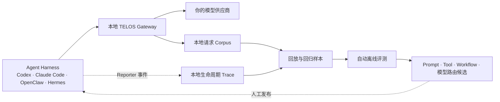

<div align="center">


### 上下文归你，经验留下，Agent 持续变好

**将长任务上下文私有化，把真实生产轨迹变成可回放样本与离线进化证据。**

<sub>🔒 本地优先 &nbsp;·&nbsp; 🔌 Harness 无关 &nbsp;·&nbsp; ⏪ 可回放 &nbsp;·&nbsp; 🧬 为持续进化而生</sub>

<br/>

[](LICENSE)
[](pyproject.toml)
[](CHANGELOG.md)
[](CHANGELOG.md)

[**快速开始**](#quickstart) &nbsp;·&nbsp; [**工作原理**](#how-it-works) &nbsp;·&nbsp; [**当前能力**](#what-ships-today) &nbsp;·&nbsp; [**设计决策**](docs/adr/0001-local-trace-and-task-type-evolution.md)

[📖 English](README.md) &nbsp;|&nbsp; **🇨🇳 简体中文**

</div>

---

## 从 Agent 网关到 Agent 学习系统

Agent 已经可以连续工作数小时，但它的运行上下文仍寄存在某个 Harness 中，散落在不透明的日志里，并随任务结束而丢失。同一种失败会反复修复，真实生产经验很少能沉淀为回归样本、离线评测或训练数据。

TELOS 是位于 Agent Harness 与模型之间的本地控制面。它的目标是让长任务上下文：

- **私有**：持久化在你控制的本地环境中，没有 TELOS 云端遥测。
- **可迁移**：不被某个 Harness 或模型供应商绑定。
- **可回放**：真实生产任务可以转化为可复现样本。
- **可进化**：结果证据可以驱动 Prompt、Tool、Workflow 和模型路由的离线评测。

Prompt Cache 优化仍然是 TELOS 的底层能力，但它现在服务于更完整的目标：**留下上下文，从工作中学习，让下一次执行更好。**

<a id="how-it-works"></a>

## 工作原理



TELOS 保存两类互补记录：

1. **Gateway Corpus** 保存模型请求，用于确定性回放与成本对比。
2. **Harness Reporter Trace** 保存模型 API 看不到的生命周期事件：执行尝试、工具结果、审批、工作区变更、产物、反馈与最终结果。

两者通过 `session_id` 关联为同一份任务历史，同时保留既有 replay 数据格式。

<a id="what-ships-today"></a>

## 当前能力

| 能力 | 状态 |
|---|---|
| 为 Codex、Claude Code、OpenClaw 和 Hermes 注入本地 Gateway | **已可用** |
| 在本地记录模型请求 Corpus，并跨模式回放会话 | **已可用** |
| 带鉴权的 Reporter 接口与本地 append-only 事件存储 | **已可用** |
| `telos evolve --task` 任务类型策略，默认离线评测、人工发布 | **已可用** |
| 为每个 Harness 自动采集 Tool、Approval、Workspace 事件的原生 Reporter Hook | **下一阶段** |
| 自动结果标注、失败归因、回归集生成和候选方案评测 | **下一阶段** |
| SFT/RL 数据集导出 | **规划中** |

当前 `evolve` 命令只负责配置进化策略，尚不会启动评测 Worker，也不会自动修改生产 Agent 行为。

<a id="quickstart"></a>

## 快速开始

```bash
# 安装（Linux / macOS / WSL2 / Android Termux）
curl -fsSL https://raw.githubusercontent.com/learningCatHD/telos-sdk/main/scripts/install.sh | bash
# 或：uv pip install -U telos-sdk

# 接管一个 Harness。之后新启动的 Codex 进程会经过本地 Gateway。
telos init --harness codex

# 为某类任务开启离线进化策略。
telos evolve --task "代码缺陷修复"

# 查看 Harness 注入、Gateway 和流量转发状态。
telos status
```

执行 `telos init` 后请启动一个新的 Harness 进程；已经运行的进程不会追溯加载新的模型供应商配置。

查看流量和成本节省：

```bash
telos dashboard
```

## 默认私有、随时迁移

TELOS 将状态持久化到 `~/.telos/`：

| 路径 | 内容 |
|---|---|
| `config.json` | Gateway、Harness Trace 和进化策略；包含本地 Reporter Token |
| `corpus/` | 用于回放的原始模型请求 |
| `traces/<harness>/` | append-only Reporter 事件流 |
| `usage.jsonl` | Token 用量与成本指标 |

这些文件可能包含 Prompt、源代码、工具结果，以及模型请求中出现的凭据，应按敏感数据保护。TELOS 不会把它们上传到 TELOS 服务，但你配置的模型供应商仍会收到完成推理所需的请求。

迁移时，停止 Gateway，安全复制完整的 `~/.telos/` 目录，再在目标设备启动 TELOS 即可；不依赖托管控制面或专有数据库。

## Trace 数据模型

TELOS 使用一套贴合 Agent 实际工作的最小层级：

```text
TaskType  →  TaskRun  →  Attempt  →  Event
```

- **TaskType**：可复用的任务类别，例如“代码缺陷修复”。
- **TaskRun**：一次具体任务及其输入和验收标准。
- **Attempt**：某组 Prompt、Tool、Workflow 和模型配置下的一次执行。
- **Event**：Attempt 中按顺序发生的事实。

Hook Adapter 可以通过 CLI 上报生命周期事件，无需自行读取 Reporter 凭据：

```bash
telos report \
  --harness codex \
  --session task-123 \
  --event tool.finished \
  --data '{"tool":"pytest","exit_code":1}'
```

本地存储会分配单调递增序号、按 `event_id` 去重，并为每个 Harness Session 写入独立 JSONL 事件流。

## 自我进化契约

目标闭环默认离线运行，并以证据为门槛：

```text
生产 Trace
  → 结果标签与失败归因
  → 冻结的回归样本
  → 单变量候选改动
  → 配对离线评测
  → 优化建议
  → 人工发布
```

每个候选方案只改变 Prompt、Tool 策略、Workflow 或模型路由中的一项，避免多个变量同时变化而无法归因。私有评测标准不会进入候选生成上下文；通过评测的候选只会被推荐，不会静默发布到生产环境。

完整取舍、替代方案与阶段边界见 [ADR-0001：本地 Trace 与按任务类型持续进化](docs/adr/0001-local-trace-and-task-type-evolution.md)。

## 上下文与成本优化仍然存在

TELOS 仍会把 Agent 上下文规范化为稳定 IR，并为模型供应商的 KV Cache 复用进行排列。在既有的 OpenClaw 六轮实测中，总成本从 `$0.3623` 降至 `$0.0281`（`−92.3%`）；SWE-bench Verified 测得 new input `−52.8%`、端到端成本 `−40.5%`，解决率无统计显著回归。

详见[协议](https://docs.telosai.pro/zh/concepts/protocol)、[Benchmark 方法](https://docs.telosai.pro/zh/benchmark/swebench)和[支持矩阵](https://docs.telosai.pro/zh/reference/support-matrix)。

## 文档

| 主题 | 参考 |
|---|---|
| 本地 Trace 与进化决策 | [ADR-0001](docs/adr/0001-local-trace-and-task-type-evolution.md) |
| 当前实现架构 | [docs/ARCHITECTURE.md](docs/ARCHITECTURE.md) |
| 安装与集成 | [docs.telosai.pro](https://docs.telosai.pro/zh/start/installation) |
| 版本历史 | [CHANGELOG.md](CHANGELOG.md) |

## 参与贡献与许可证

欢迎提交 Issue 和 Pull Request。运行测试：

```bash
pytest
```

TELOS Core 使用 [Apache 2.0](LICENSE) 许可证。

## Citation

```bibtex
@misc{wang2026telos-agent,
  title        = {Telos: A Cost-Aware Inference Infrastructure for AI Agent},
  author       = {Zheng Wang, Shenzhi Wang, HongTao Zhong, Shiji Song, Gao Huang},
  howpublished = {\url{https://github.com/learningCatHD/telos-sdk.git}},
  year         = {2026}
}
```

<div align="center">

**留下上下文，从工作中学习，让下一次执行更好。**

</div>
