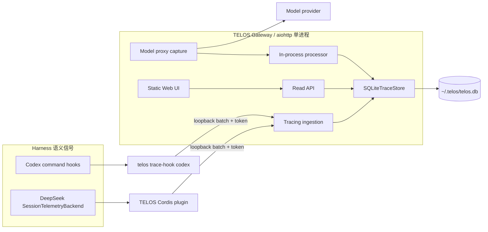
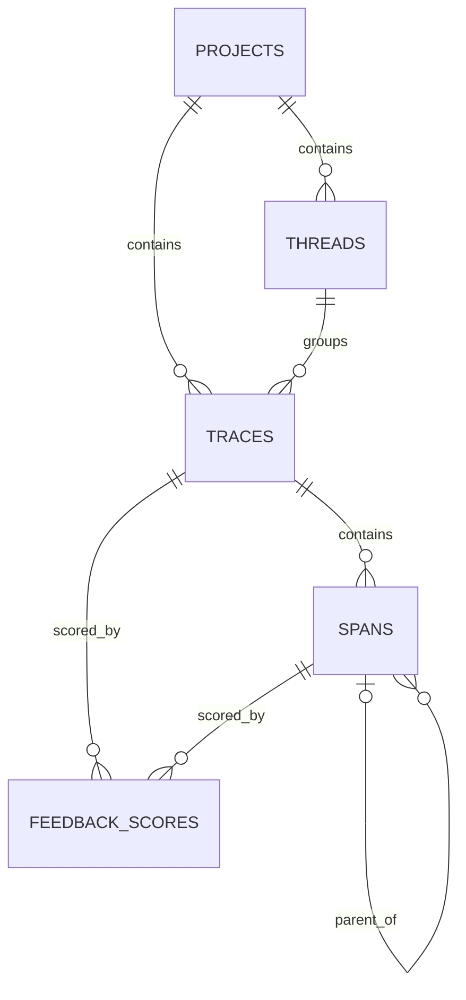

# ADR-0002：以 Trace/Span 重构本地 Agent Tracing 平台

**状态：** Accepted  
**日期：** 2026-08-27  
**相关决策：** 若本 ADR 被接受，将取代 ADR-0001 中的 Reporter endpoint、七种固定事件和
`TraceStore` JSONL 持久化；ADR-0001 的 corpus/replay 与持续进化决策继续有效，直到各自有后续
ADR 取代。

## 摘要

TELOS 将采用 Opik 的核心抽象——`Thread → Trace → Span`、processor 生命周期回调、
幂等 upsert 和 Trace 瀑布视图——但不复制 Opik 的 Java、ClickHouse、React 全栈。

首版使用现有 Python/aiohttp 进程、标准库 SQLite 和静态 Web 资源：Gateway 是唯一数据库
写入者；Codex Hook 与 DeepSeek Harness telemetry plugin 通过 loopback batch API 上报；
Gateway 补充模型请求、响应、usage、TTFT 和成本。首批 installer 为 Codex 与
`deepseek-ai/deepseek-harness`。

## 背景

当前 TELOS 有两条互相分离的数据路径：

1. Gateway 把模型请求写入 `~/.telos/corpus/*.jsonl`；
2. Harness 通过 `POST /__telos/reporter/events` 上报七种固定事件，再由 `TraceStore`
   写入 `~/.telos/traces/**/*.jsonl`。

这套 Reporter 适合验证“Hook 能否送达”，不适合作为 tracing 产品的数据模型：

- 固定 `kind` 无法自然表达父子 Span、运行中状态、增量结束、LLM usage 和 TTFT；
- start/end 被拆成日志行，读取端必须重放并猜测实体状态；
- JSONL 不适合 Web 的筛选、分页、聚合、幂等更新和跨 Thread 查询；
- Gateway 只能看到模型协议，不能看到 Harness 的 turn、tool、approval、subagent 语义；
- Harness adapter 能看到 Agent 语义，但 Codex Hook 看不到模型 usage；
- corpus、Reporter 和未来 Web 若各自定义一次“运行”，会产生三个不一致事实源。

Codex 与 DeepSeek Harness 已经提供稳定扩展面，不需要把 TELOS 的 `TraceImpl` 注入它们的
运行时代码：

- Codex command hooks 提供 `session_id`、`turn_id`、`tool_use_id`、`agent_id`；
- DeepSeek Harness 提供 `SessionTelemetryBackend`、`SessionTelemetryCoordinator` 以及完整的
  session event ledger。

## 决策驱动

- 一个数据模型必须同时表达 Agent turn、LLM、tool、subagent、approval 和 compaction；
- adapter 重试、Hook 重复执行和 Gateway 重启不能产生重复 Trace/Span；
- tracing 故障必须 fail-open，不得阻断 Agent 主循环；
- 首版保持单机、单用户、零外部数据库，并复用 aiohttp 与 Python 标准库；
- 能支撑类似 Opik 的 Trace 列表、Span tree/waterfall、Thread 时间线和 feedback；
- 保存足够完整的本地数据供后续 replay/evaluation 使用；
- installer 必须幂等、可卸载，并且不覆盖用户已有 Hook 或 telemetry 配置；
- 同一次模型调用只能产生一个权威 LLM Span。

## 目标与非目标

### 目标

- 建立稳定的 Thread、Trace、Span 领域模型和 Python tracing API；
- 建立 SQLite tracing 数据库、写入 API 与查询 API；
- 完成 Codex 和 DeepSeek Harness 的语义级 adapter/installer；
- Gateway 捕获准确的模型请求/响应、usage、TTFT、provider/model 和成本；
- 交付本地 Web MVP。

### 非目标

- 首版不复制 Opik 的 experiments、datasets、prompt management、online evaluation 和告警；
- 不引入 ClickHouse、PostgreSQL、Kafka、Redis、Java 服务或独立前端构建链；
- 不承诺 Codex 当前 Hook 没有暴露的事实，例如用户最终的 approval allow/deny；
- 不在本 ADR 中重构持续进化闭环；它只消费新的 Trace 数据。

## 考虑过的方案

| 方案 | 优点 | 缺点 | 结论 |
|---|---|---|---|
| 扩展 Reporter + JSONL | 变更小，可继续追加事件 | 仍需重放状态；树查询、分页、upsert 和 Web 聚合复杂 | 否决 |
| 完整移植 Opik | 功能丰富，已有大规模经验 | Java + ClickHouse + React 对本地单用户产品过重 | 否决 |
| OpenTelemetry 作为唯一模型 | 生态标准，exporter 丰富 | Agent thread/feedback/upsert 和本地产品查询仍需自定义存储语义 | 仅作为未来 exporter |
| Opik 语义 + SQLite/aiohttp | 保留核心模型，复用现有进程，能直接支持 Web | 单机写入和聚合规模有限 | 采用 |

## 决策

### 1. 统一运行模型

```text
Project                         本地逻辑分组，默认项目为 "default"
└── Thread                      Harness session / conversation
    └── Trace                   一次 user turn / agent attempt
        └── Span                agent step / LLM / tool / approval / compaction
```

具体定义：

| 实体 | 语义 | 示例外部标识 |
|---|---|---|
| Thread | 一次可跨多个 turn 的 Harness 会话 | Codex `session_id`；DSH `session.id` |
| Trace | 一次用户输入触发的完整 Agent turn | Codex `(session_id, turn_id)`；DSH `(session.id, turn)` |
| Span | Trace 内有时间边界的工作单元 | `tool_use_id`、`callId`、`step` |

Span 类型首版固定为：

```text
general | agent | llm | tool | approval | compaction
```

Trace/Span 状态为：

```text
running | ok | error | cancelled | abandoned | unknown
```

状态迁移只允许：

```text
running → ok | error | cancelled | abandoned | unknown
unknown | abandoned → ok | error | cancelled    # 晚到的权威结束信号
```

`ok/error/cancelled` 是终态，晚到的 start 不能把实体重新变为 `running`。`start_time_us`
取最早有效值；结束事件只补充/更新结束字段，不清空已存在字段。

内部 ID 采用两种策略：

- adapter 实体：对 `harness + 外部层级 ID` 做 UUIDv5，Hook 进程无状态也能得到同一 ID；
- Gateway 自生且没有外部 ID 的 LLM Span：UUIDv4。

数据库仍保留 `external_id` 和唯一约束，不能只依赖 UUID 生成正确性。

### 2. Processor 生命周期，而不是 Reporter event 枚举

Tracing core 提供最小生命周期协议：

```python
class TraceProcessor:
    def on_trace_start(self, trace): ...
    def on_trace_end(self, trace): ...
    def on_span_start(self, span): ...
    def on_span_end(self, span): ...
    def force_flush(self): ...
    def shutdown(self): ...
```

`Trace`/`Span` 持有 processor。调用对象的 `start()`/`finish()` 时，完整实体快照进入
processor，而不是产生固定类型的 Reporter event：

```python
class Trace:
    def start(self, mark_as_current=False):
        self.processor.on_trace_start(self)
        if mark_as_current:
            set_current_trace(self)

    def finish(self, reset_current=False):
        self.processor.on_trace_end(self)
        if reset_current:
            reset_current_trace()
```

Python SDK 用 `contextvars` 保存 current trace/span，因此 async task 的子 Span 自动获得
父 ID，又不会在线程或协程之间泄漏。首版只需要两个实际 processor：

- Gateway 内部 processor：直接调用 SQLite store；
- HTTP batch processor：供常驻 adapter 使用，内存队列批量 POST。

Codex Hook 是一次一进程的 command hook，不依赖进程内 current context；它从 Hook payload
计算稳定 ID 后提交单个 batch。DeepSeek plugin 是常驻进程，可使用队列、批量和 shutdown
drain。

这不是向 Codex/DeepSeek 的类中注入 `Trace.start()`。adapter 在原生扩展点收到生命周期信号，
再调用 TELOS tracing API；领域对象和 Harness 代码保持解耦。

### 3. 组件与数据流



只有 Gateway 进程打开可写 SQLite 连接。外部 adapter 不直接写数据库，因此不需要跨进程锁、
消息队列或独立 ingest service。

事实源分工：

| 数据 | 权威来源 |
|---|---|
| Thread/turn/tool/subagent/compaction 生命周期 | Harness adapter |
| 原始模型协议、HTTP 状态、streaming、TTFT | Gateway |
| Codex model/usage/cost | Gateway |
| DeepSeek model/usage | DeepSeek adapter |
| feedback | Web/API |

每个 Harness 在安装配置中声明 `model_span_source`：

```text
codex            = gateway
deepseek-harness = adapter
```

Gateway 对 `adapter` 模式不再创建第二个 LLM Span，避免双计 token 和成本。

### 4. SQLite 数据库

数据库位置为 `~/.telos/telos.db`。进程启动时执行：

```sql
PRAGMA journal_mode = WAL;
PRAGMA foreign_keys = ON;
PRAGMA busy_timeout = 5000;
```

所有时间使用 UTC Unix 微秒整数；持续时间查询为 `end_time_us - start_time_us`，不重复存储。
任意结构字段保存为 canonical JSON TEXT，并在 API 信任边界验证；token、TTFT 和成本同时拆成
显式列供筛选和聚合。成本使用 USD micro（`1 USD = 1,000,000`）整数，避免浮点累计误差。

核心 schema：

```sql
CREATE TABLE schema_migrations (
    version       INTEGER PRIMARY KEY,
    applied_at_us INTEGER NOT NULL
);

CREATE TABLE projects (
    id                 TEXT PRIMARY KEY,
    name               TEXT NOT NULL UNIQUE,
    created_at_us      INTEGER NOT NULL,
    last_updated_at_us INTEGER NOT NULL
);

CREATE TABLE threads (
    id                 TEXT PRIMARY KEY,
    project_id         TEXT NOT NULL REFERENCES projects(id) ON DELETE CASCADE,
    harness            TEXT NOT NULL,
    external_id        TEXT NOT NULL,
    name               TEXT,
    status             TEXT NOT NULL DEFAULT 'running'
                       CHECK (status IN ('running','ok','error','cancelled','abandoned','unknown')),
    start_time_us      INTEGER NOT NULL,
    end_time_us        INTEGER,
    metadata_json      TEXT NOT NULL DEFAULT '{}',
    created_at_us      INTEGER NOT NULL,
    last_updated_at_us INTEGER NOT NULL,
    UNIQUE (project_id, harness, external_id),
    CHECK (end_time_us IS NULL OR end_time_us >= start_time_us)
);

CREATE TABLE traces (
    id                   TEXT PRIMARY KEY,
    project_id           TEXT NOT NULL REFERENCES projects(id) ON DELETE CASCADE,
    thread_id            TEXT NOT NULL REFERENCES threads(id) ON DELETE CASCADE,
    harness              TEXT NOT NULL,
    source               TEXT NOT NULL,
    external_id          TEXT NOT NULL,
    name                 TEXT NOT NULL,
    status               TEXT NOT NULL DEFAULT 'running'
                         CHECK (status IN ('running','ok','error','cancelled','abandoned','unknown')),
    start_time_us        INTEGER NOT NULL,
    end_time_us          INTEGER,
    input_json           TEXT,
    output_json          TEXT,
    metadata_json        TEXT NOT NULL DEFAULT '{}',
    tags_json            TEXT NOT NULL DEFAULT '[]',
    error_json           TEXT,
    source_updated_at_us INTEGER NOT NULL,
    created_at_us        INTEGER NOT NULL,
    last_updated_at_us   INTEGER NOT NULL,
    UNIQUE (project_id, harness, external_id),
    CHECK (end_time_us IS NULL OR end_time_us >= start_time_us)
);

CREATE TABLE spans (
    id                   TEXT PRIMARY KEY,
    trace_id             TEXT NOT NULL REFERENCES traces(id) ON DELETE CASCADE,
    parent_span_id       TEXT REFERENCES spans(id) ON DELETE CASCADE,
    source               TEXT NOT NULL,
    external_id          TEXT NOT NULL,
    name                 TEXT NOT NULL,
    type                 TEXT NOT NULL DEFAULT 'general'
                         CHECK (type IN ('general','agent','llm','tool','approval','compaction')),
    status               TEXT NOT NULL DEFAULT 'running'
                         CHECK (status IN ('running','ok','error','cancelled','abandoned','unknown')),
    start_time_us        INTEGER NOT NULL,
    end_time_us          INTEGER,
    input_json           TEXT,
    output_json          TEXT,
    metadata_json        TEXT NOT NULL DEFAULT '{}',
    tags_json            TEXT NOT NULL DEFAULT '[]',
    usage_json           TEXT NOT NULL DEFAULT '{}',
    input_tokens         INTEGER,
    output_tokens        INTEGER,
    cache_read_tokens    INTEGER,
    cache_write_tokens   INTEGER,
    reasoning_tokens     INTEGER,
    model                TEXT,
    provider             TEXT,
    cost_usd_micros      INTEGER,
    ttft_us              INTEGER,
    error_json           TEXT,
    source_updated_at_us INTEGER NOT NULL,
    created_at_us        INTEGER NOT NULL,
    last_updated_at_us   INTEGER NOT NULL,
    UNIQUE (trace_id, source, external_id),
    CHECK (end_time_us IS NULL OR end_time_us >= start_time_us)
);

CREATE TABLE feedback_scores (
    id                 TEXT PRIMARY KEY,
    trace_id           TEXT REFERENCES traces(id) ON DELETE CASCADE,
    span_id            TEXT REFERENCES spans(id) ON DELETE CASCADE,
    name               TEXT NOT NULL,
    value              REAL NOT NULL,
    reason             TEXT,
    source             TEXT NOT NULL DEFAULT 'user',
    created_at_us      INTEGER NOT NULL,
    last_updated_at_us INTEGER NOT NULL,
    CHECK (
        (trace_id IS NOT NULL AND span_id IS NULL) OR
        (trace_id IS NULL AND span_id IS NOT NULL)
    )
);

CREATE INDEX idx_threads_project_start
    ON threads(project_id, start_time_us DESC, id DESC);
CREATE INDEX idx_traces_project_start
    ON traces(project_id, start_time_us DESC, id DESC);
CREATE INDEX idx_traces_thread_start
    ON traces(thread_id, start_time_us, id);
CREATE INDEX idx_traces_harness_status_start
    ON traces(harness, status, start_time_us DESC);
CREATE INDEX idx_spans_trace_start
    ON spans(trace_id, start_time_us, id);
CREATE INDEX idx_spans_parent_start
    ON spans(parent_span_id, start_time_us, id);
CREATE INDEX idx_spans_type_model_start
    ON spans(type, model, start_time_us DESC);
CREATE INDEX idx_feedback_trace ON feedback_scores(trace_id, created_at_us);
CREATE INDEX idx_feedback_span ON feedback_scores(span_id, created_at_us);
```



首版不建立 trace summary/materialized aggregation 表。Trace 列表通过 `spans.trace_id` 索引聚合
token/cost；只有实测列表查询超出目标后才增加 summary 表。

### 5. 写入协议与幂等规则

外部写入只提供一个入口，避免为每类实体维护 POST/PATCH/batch 三套逻辑：

```text
POST /__telos/tracing/v1/batch
Authorization: Bearer <per-harness-token>
```

请求包含 `schema_version` 和最多 256 个完整实体 upsert；默认 payload 上限 1 MiB：

```json
{
  "schema_version": 1,
  "operations": [
    {"entity": "thread", "op": "upsert", "body": {}},
    {"entity": "trace", "op": "upsert", "body": {}},
    {"entity": "span", "op": "upsert", "body": {}}
  ]
}
```

一个 batch 在单个 SQLite transaction 中执行，并逐项返回 `id/created/updated/error`。失败的
transport 可重试整个 batch；唯一约束和稳定 ID 保证幂等。

Upsert 合并规则由 store 集中实现：

- `source_updated_at_us` 较旧的快照不能覆盖较新的非空字段；
- start 快照只补 start/input/metadata，不清除 end/output/error；
- 终态遵循前述状态机，不能被 `running` 重新打开；
- 关联的 project/thread/trace 必须存在于同一批次之前或数据库中；
- `parent_span_id` 必须属于同一 Trace；
- token、authorization/cookie、完整环境变量和 provider secret 永不进入 metadata。

adapter 侧所有异常均被捕获并记录到本地诊断日志；Hook 返回成功/no-op，Agent 继续运行。
DeepSeek 队列满时丢弃最旧 telemetry 并累计 dropped counter，不允许无界内存增长。

### 6. Gateway 模型 Span

Gateway 对模型请求创建 `llm` Span：

1. 请求进入时写 `running` Span 和原始请求；
2. 首个响应字节/首个 SSE data frame 记录 `ttft_us`；
3. 非流式响应完成，或流式 EOF，到达时写 output、usage、HTTP 状态和 `ok`；
4. provider error、上游断开或解析失败写 error；客户端取消写 `cancelled`；
5. 从 model/provider/usage 和本地价格表计算 `cost_usd_micros`。

对于 Codex Responses 路由，Gateway 必须优先使用 Codex 已发送的 `session_id` header，而不是
现有 `_derive_session_id()`。Tracing store 维护该 Thread 当前唯一 `running` Trace，Gateway
把 LLM Span 关联到它。找不到活动 Trace 时不丢数据，而是创建 `metadata.correlation =
"unmatched"` 的 synthetic Trace；Web 明确显示低置信度关联。

Codex 请求只携带 session ID，没有可靠的 turn/agent Span header。因此首版 Gateway LLM Span
直接挂在 Trace 根部，不伪造与某个 subagent/step 的父子关系。

当 `model_span_source=adapter`（DeepSeek）时，Gateway 不创建 LLM Span；DeepSeek 的
`assistant/message` 自带 step、message 和 usage，能建立更准确的层级。

### 7. Codex adapter 与 installer

Codex 映射如下：

| Codex Hook | TELOS 操作 | 可捕获内容 |
|---|---|---|
| `SessionStart` | upsert Thread | session、cwd、model、permission mode、source |
| `UserPromptSubmit` | start Trace | `turn_id`、prompt、agent、model |
| `PreToolUse` | start tool Span | `tool_use_id`、name、input、agent |
| `PostToolUse` | finish tool Span | response；错误状态按结构 best-effort 解析 |
| `SubagentStart` | start agent Span | `agent_id`、type |
| `SubagentStop` | finish agent Span | last assistant message |
| `PermissionRequest` | 写瞬时 approval Span | tool/input；最终用户决定当前不可见，状态为 `unknown` |
| `PreCompact` | start compaction Span | trigger、agent、model |
| `PostCompact` | finish compaction Span | trigger |
| `Stop` | finish Trace `ok` | last assistant message |
| `Interrupt` | finish Trace `cancelled` | interrupt signal |
| `SessionEnd` | 结束 Thread；关闭遗留运行实体 | reason；无 `turn_id` |

稳定 ID：

```text
thread = uuid5("codex:thread:{session_id}")
trace  = uuid5("codex:trace:{session_id}:{turn_id}")
tool   = uuid5("codex:tool:{session_id}:{turn_id}:{tool_use_id}")
agent  = uuid5("codex:agent:{session_id}:{turn_id}:{agent_id}")
```

`PermissionRequest` Hook 是决策前扩展点。TELOS 必须返回无决策的合法输出，绝不能为了 tracing
改变批准结果；因此 Web 只能展示“requested”，不能声称捕获了 allow/deny。

Installer 在现有 `CodexInstaller` 的 provider 配置之外增加一个 TELOS 自有 Codex plugin：

```text
~/.telos/integrations/codex/telos-tracing/
├── .codex-plugin/plugin.json   # hooks: "./hooks/hooks.json"
└── hooks/hooks.json            # command: telos trace-hook codex
```

安装步骤：

1. 写入带版本号的自有 plugin bundle；
2. 通过 Codex plugin manager/CLI 注册并启用本地 plugin，不直接写 Codex cache；
3. hooks 从 stdin 读取 JSON，token 由 `telos` CLI 从 `~/.telos/config.json` 读取；
4. 验证 plugin 已加载且 12 类 Hook 声明可发现；
5. `UserPromptSubmit` 使用短超时同步写入，以便紧随其后的模型请求能关联 turn；其他高频 Hook
   可异步，`SessionEnd` 遵守 Codex 的同步/最长三秒约束；
6. 旧版 Codex 不支持 plugin hooks 时，才回退到带 TELOS begin/end marker 的
   `~/.codex/hooks.json` 合并，并在结果中明确报告 compatibility mode。

重复安装更新自有 bundle，不重复添加 Hook。卸载只删除/注销 TELOS plugin 或 marker block，
同时保留数据库历史和用户其他 Hook。

### 8. DeepSeek Harness adapter 与 installer

DeepSeek Harness adapter 是一个很薄的 Cordis plugin：继承原生
`SessionTelemetryBackend`，在构造时复用 `SessionTelemetryCoordinator`，`emit()` 只做同步
入队，后台用原生 `fetch()` 发送 batch，`shutdown()` 等待队列 drain。插件发布为已编译 `.mjs`，
不增加 npm runtime dependency。

事件映射：

| DeepSeek event | TELOS 操作 |
|---|---|
| `turn/start` | start Trace |
| `user/message` | 更新 Trace input |
| `step/start` | start agent/general step Span |
| 首个 `assistant/chunk` | 设置该 step LLM Span 的 TTFT |
| `assistant/message` | finish LLM Span，写 output/model/usage |
| `tool/call` | start tool Span，稳定键为 `callId` |
| `tool/result` | finish tool Span，按 `isError` 设置状态 |
| `step/end` | finish step Span |
| `turn/end` | 按 reason finish Trace |
| `agent/error` | finish 当前 Span/Trace 为 error |
| shutdown | 将遗留 `running` 实体标记为 `abandoned` |

稳定层级：

```text
Thread: (session.id)
Trace:  (session.id, turn)
Step:   (session.id, turn, step)
LLM:    (session.id, turn, step, assistant message/event seq)
Tool:   (session.id, turn, step, callId)
```

Installer 增加 `deepseek-harness` 到 Harness registry，并：

1. 用 `dsh --profile <name> --dump-config` 定位并验证 profile；
2. 把 TELOS `.mjs` asset 安装到 `~/.telos/integrations/deepseek-harness/`；
3. 原子修改该 profile 的 `cordis.patch.yml`，注册 TELOS telemetry backend；
4. 配置只引用权限为 `0600` 的 token file，不把 token 打到命令输出；
5. 再次运行 `--dump-config` 验证实际合成配置；
6. uninstall 只撤销 TELOS 拥有的 patch row。

Cordis 的 `sessionTelemetry` service 只允许一个实现。检测到现有 OTel 或其他 backend 时，
installer 默认停止并报告冲突；只有显式 `--replace-telemetry-backend` 才替换，并保存可恢复备份。
首版不构建多 backend fan-out。

### 9. Web 端

复用 Gateway 的 aiohttp，入口为：

```text
GET  /__telos/traces
GET  /__telos/api/v1/projects
GET  /__telos/api/v1/traces
GET  /__telos/api/v1/traces/{id}
GET  /__telos/api/v1/threads/{id}
POST /__telos/api/v1/feedback-scores
```

`GET traces` 使用 `(start_time_us, id)` opaque cursor，不使用越翻越慢的 offset。支持 project、
harness、status、model、时间范围和文本筛选。Trace detail 一次返回 Trace、Span 和 feedback；
Thread detail 返回按时间排序的 Trace timeline。

Web MVP 信息架构：

```text
Trace 列表
├── name / harness / status / duration / tokens / cost / time
├── filter + search
└── 选择 Trace
    ├── Span tree + waterfall
    ├── Input / Output / Metadata / Usage / Error tabs
    ├── Thread timeline
    └── Feedback score
```

首版使用一个原生 ES module 和 CSS，由 aiohttp 直接提供，不增加 React/Vite。每两秒轮询活动
Trace；不引入 WebSocket。列表 API 返回截断预览，detail 按需返回全文。所有 Trace 内容通过
DOM `textContent` 渲染，禁止把模型/工具输出作为 HTML 注入。

默认只监听 loopback。若用户显式绑定非 loopback 地址，则 write/read API 和 Web session 全部
必须鉴权，不能只保护 ingest。

### 10. 与 corpus 的迁移

旧 Reporter 未进入需要保留的生产数据阶段，因此不再实现 importer，直接删除其 endpoint、CLI、
JSONL `TraceStore`、测试和文档入口。新 Trace/Span 只写 SQLite；corpus 暂时保留为 replay 的
兼容事实源。replay 能从 `llm` Span 读取等价原始请求并通过回归测试后，再停止 corpus 双写。

## 交付阶段与验收

### 阶段 A：Tracing core + SQLite 纵向切片

- `Trace`、`Span`、current context、processor；
- migration、store、batch ingest 和只读 detail API；
- Gateway 内部可写一个完整 LLM Span；
- 测试覆盖 start/finish、父子 context、幂等 retry、终态不重开、transaction rollback。

**验收：** 一个合成 Trace 可经 processor 入库，重发后行数不变，API 返回相同 Span tree。

### 阶段 B：Codex installer + Gateway enrichment

- Codex plugin/hook command、12 类 Hook fixture；
- Responses route 使用 `session_id` header；
- streaming output、usage、TTFT 和成本写入；
- installer 重复执行与 uninstall 不改动用户 Hook。

**验收：** 一次真实 Codex turn 显示 prompt、tool、subagent/compaction（发生时）、assistant
output 和 LLM usage；中断为 `cancelled`；Gateway 停止时 Codex 仍能 fail-open。

### 阶段 C：DeepSeek Harness installer

- Cordis backend、batch queue、shutdown drain；
- profile patch、conflict detection、dump-config 验证；
- 事件 fixture 覆盖 tool error、turn error、interrupt 和 usage。

**验收：** 一次真实 DSH turn 形成 Trace → step → LLM/tool 树，无重复 LLM Span；插件网络失败
不影响 Agent 返回。

### 阶段 D：Web MVP

- Trace list/filter/cursor；
- Span tree/waterfall/detail tabs；
- Thread timeline、feedback；
- 活动 Trace 轮询和安全文本渲染。

**验收：** Codex 与 DSH Trace 可在同一页面筛选和比较；1 万 Trace 的首屏查询目标 p95
低于 200 ms（开发机、本地热缓存）。

### 阶段 E：迁移与删除旧 Reporter

- ~~legacy importer 与计数校验~~（无生产数据，按明确决策取消）；
- 删除 Reporter endpoint/CLI/TraceStore；**已完成**
- replay 改读 LLM Span 后停止新 corpus 双写。

## 后果

### 正面

- Agent 运行有一个可查询的统一事实模型，不再由 Web 重放固定事件；
- adapter 保留 Harness 语义，Gateway 保留模型协议精度；
- SQLite 和静态 Web 足以交付本地 Opik-like 体验，运维面没有增加；
- 稳定外部 ID + upsert 可自然吸收 Hook 重试和乱序；
- 新模型可以直接作为 replay、evaluation 和持续进化的数据入口。

### 负面

- SQLite 仍是单机数据库，不适合多节点或高写入 SaaS；
- Codex LLM Span 首版不能可靠挂到具体 subagent，approval 也没有最终决定；
- 完整 request/output 会增加磁盘和隐私风险；
- Codex plugin API 与 DeepSeek profile schema 版本变化需要 installer compatibility tests。

### 风险与缓解

| 风险 | 缓解 |
|---|---|
| SQLite 写锁/文件损坏 | 单 Gateway writer、WAL、短 transaction、migration 备份 |
| adapter 产生重复 LLM Span | 安装时固定 `model_span_source`，数据库唯一约束 |
| Hook 超时拖慢 Agent | loopback、短超时、fail-open；高频事件异步 |
| 乱序把终态重开 | store 状态机和 `source_updated_at_us` 合并规则 |
| Trace 内容泄露 | loopback 默认、文件权限、secret denylist、远程绑定全鉴权 |
| 数据无限增长 | 首版展示 DB 大小；只有用户需要时再增加显式 retention/export |

SQLite 的升级触发条件不是预先猜测的行数，而是实测：如果单机目标数据量下写入持续阻塞，或
Trace 列表在合理索引后仍无法达到 p95 200 ms，再写 ADR 评估 PostgreSQL/ClickHouse。首版不为
这个假设增加第二套存储。

## 参考

- [Opik repository](https://github.com/comet-ml/opik)
- [Opik traces schema](https://github.com/comet-ml/opik/blob/main/apps/opik-backend/src/main/resources/liquibase/db-app-analytics/migrations/000101_create_traces_local_v2_table.sql)
- [Opik spans schema](https://github.com/comet-ml/opik/blob/main/apps/opik-backend/src/main/resources/liquibase/db-app-analytics/migrations/000115_create_spans_local_v2_table.sql)
- [Codex hooks schema](https://github.com/openai/codex/blob/main/codex-rs/hooks/src/schema.rs)
- [DeepSeek Harness session telemetry](https://github.com/deepseek-ai/DeepSeek-Harness/tree/main/packages/session/session-telemetry)
- [ADR-0001：本地 Trace 与按任务类型持续进化](./0001-local-trace-and-task-type-evolution.md)
