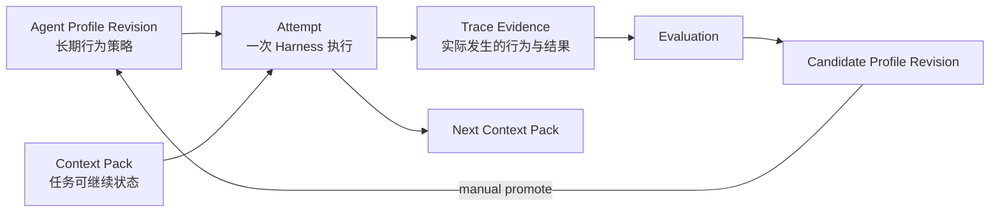
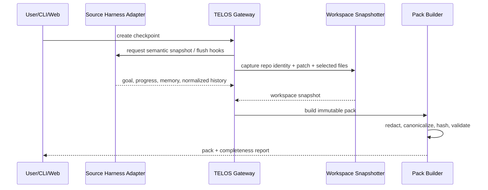
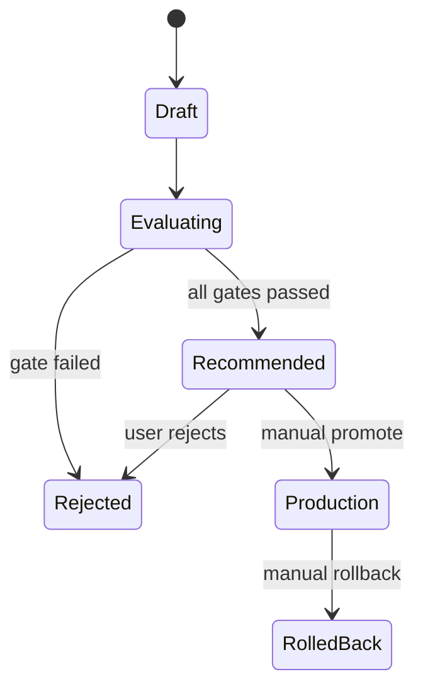

# ADR-0003：可移植 Context Pack、Harness Handoff 与自进化控制面

**状态：** Accepted（已实现）

**日期：** 2026-08-28
**相关决策：** 补充 [ADR-0002](./0002-opik-style-agent-tracing-platform.md) 的证据层；将
[ADR-0001](./0001-local-trace-and-task-type-evolution.md) 中尚未落地的 TaskRun、Attempt、
`.telosbundle` 与持续进化闭环具体化。

## 摘要

TELOS 的产品目标不是另一个 Trace 查看器，而是：

> 将一次 Agent 工作的可继续状态随时冻结为可验证、可导出、可移植的 Context Pack；在不同
> Harness 之间以新 Attempt 继续同一 TaskRun；再用运行 Trace 和用户结果作为证据，离线产生、
> 评测并人工发布新的 Agent Profile Revision。

核心闭环为：

```text
Context Pack → Harness Handoff → Attempt → Trace Evidence
      ↑                                  ↓
      └──── promoted Profile ← Evaluation ← Candidate Revision
```

ADR-0002 的 `Thread → Trace → Span` 保持不变，但定位为证据层。新的上位模型是
`TaskType → TaskRun → Attempt`；每个 Attempt 引用一个不可变 Context Pack 和一个不可变
Agent Profile Revision。

## 背景与当前缺口

TELOS 已有：

- `TelosIR`：单次模型请求内的可移植中间表示；
- Harness/Engine adapter：在 Harness 请求与模型协议之间转换；
- Gateway：路由、缓存布局、usage 与模型 Trace；
- SQLite Trace：统一保存 Thread、Trace、Span 和 feedback；
- `telos evolve --task`：只保存离线评测、人工发布的 policy。

但这些能力还不能完成产品闭环：

| 能力 | 当前状态 | 缺口 |
|---|---|---|
| 单次请求标准化 | 已有 `TelosIR` | IR 只存在于内存，不能成为跨 Harness 的任务快照 |
| Harness 接入 | 已有 installer/proxy/hook | 只能接入流量，不能把进行中的任务交给另一个 Harness |
| 运行证据 | 已有 Trace/Span | Trace 没有关联 TaskRun、Pack 和 Profile Revision |
| 自进化 | 只有 policy 开关 | 没有 Candidate、RegressionCase、Evaluation、Promotion |
| Web | Trace Explorer | 没有 Context、Handoff、Revision 与演化谱系视图 |

## 决策驱动

- 同一个任务必须能从 Codex 切换到 Kimi Code、DeepSeek Harness 等目标 Harness；
- 切换保存的是可继续的语义状态，不伪装成迁移模型隐藏状态或 KV cache；
- Pack 必须不可变、可校验、可导出，并且默认不携带凭证；
- Harness 能力不对称时必须给出显式降级报告，不能静默丢上下文；
- 运行状态与长期行为策略必须分离，避免把某次任务内容进化进全局 Agent；
- Candidate 可自动生成和评测，但 production Revision 仍由用户人工发布；
- 所有结论都必须能下钻到冻结的评测输入和 Trace 证据；
- 首版继续使用 Python、SQLite、普通文件和 Harness 原生扩展点。

## 目标与非目标

### 目标

1. 将任意已接入 Harness 的当前任务冻结为 Context Pack；
2. 导出、导入并校验 `.telosbundle`；
3. 在 Harness 间创建有谱系关系的新 Attempt；
4. 明确显示上下文丢失、能力不兼容和降级项；
5. 从 Trace、feedback 和结果标签构建 RegressionCase；
6. 对 Agent Profile Candidate 做隔离评测、质量门判断、人工发布和回滚；
7. 提供以 Context 为中心的本地 Web 控制面。

### 非目标

- 不迁移模型私有思维链、KV cache、隐藏 system prompt 或 Harness 内部进程状态；
- 不保证在工具执行到一半时恢复到同一条机器指令；
- 不让 Optimizer 自动修改代码、Gateway 安全策略或 Harness 用户配置；
- 不自动发布 Candidate；
- 不把 TELOS 变成云端协作、账号或多租户平台；
- 首版不引入向量数据库、消息队列或独立前端框架。

## 决策

### 1. 三个互相分离的事实对象



| 对象 | 回答的问题 | 可变性 | 禁止混入的内容 |
|---|---|---|---|
| Context Pack | 这次任务进行到哪里，换 Harness 后怎样继续？ | 不可变，靠 parent 形成版本链 | 全局优化结论、凭证、隐藏思维链 |
| Agent Profile Revision | 这类任务以后应该怎样做？ | Revision 不可变，production 只移动指针 | 某次任务的私有内容与工作区数据 |
| Trace Evidence | 实际做了什么，效果、成本和错误如何？ | 幂等追加/结束 | 未发生的推测与伪造评分 |

`TelosIR` 继续是单次模型调用的 transport IR，不升级为持久化 Pack。Context Pack 可以生成
多个 TelosIR，也可以被完全不同的 Harness 原生入口消费。

### 2. 上位运行模型

```text
TaskType                         可学习的任务类别，例如 code-defect-repair
└── TaskRun                      一个具体用户目标，跨 Harness 保持同一身份
    ├── Attempt #1               Codex + Profile r7 + Pack p1
    │   └── Thread → Trace → Span
    ├── Handoff                  p1 → p2，Codex → Kimi Code
    └── Attempt #2               Kimi Code + Profile r7 + Pack p2
        └── Thread → Trace → Span
```

实体职责：

| 实体 | 必要字段 |
|---|---|
| TaskType | `id`、name、production profile revision、evolution policy |
| TaskRun | `id`、task type、goal、status、workspace identity、created/finished time |
| Attempt | `id`、task run、harness、source attempt、pack、profile revision、status |
| Handoff | source/destination attempt、pack、compatibility report、reason、status |
| ContextPack | `id`、digest、parent、task run、source attempt、capture status、schema version |
| ProfileRevision | `id`、task type、parent、content digest、state、change dimension |

ADR-0002 的 Thread 不等于 Attempt：一个 Attempt 通常对应一个 Harness Thread，但重连或 Harness
自身切分 session 时可以对应多个 Thread。Trace 通过 `attempt_id` 关联上位运行模型。

TaskRun 的 TaskType 必须由用户、调用方或已批准规则明确指定；自动分类只能建议。`unclassified`
运行可以打包和 handoff，但不能进入 Optimizer 的生产证据集，避免错误任务标签污染 Profile。

### 3. Context Pack 是语义检查点，不是 Harness 文件压缩包

Context Pack 按七个固定层组织：

| 层 | 内容 | 默认必需 |
|---|---|---|
| `objective` | 原始目标、验收标准、用户约束、任务类型 | 是 |
| `policy` | 生效的 Profile Revision、项目指令摘要、安全边界 | 是 |
| `progress` | 已完成、进行中、待办、阻塞项、下一步 | 是 |
| `memory` | 已确认事实、设计决策、假设及其置信度 | 是 |
| `conversation` | 规范化消息与必要工具结果；允许摘要和裁剪 | 否 |
| `workspace` | repo identity、HEAD、dirty 状态、patch、引用文件及 artifact | 否 |
| `provenance` | 来源 Harness/Attempt/Trace、捕获时间、每个条目的来源 | 是 |

能力需求单列在 manifest 中，不混入自然语言：

```json
{
  "schema_version": 1,
  "pack_id": "uuid",
  "digest": "sha256:...",
  "parent_pack_id": null,
  "task_run_id": "uuid",
  "source_attempt_id": "uuid",
  "capture_status": "complete",
  "capture_method": "reconstructed",
  "task_type": "code-defect-repair",
  "profile_revision_id": "uuid",
  "requirements": {
    "workspace": "read-write",
    "tools": ["shell", "file-edit"],
    "attachments": false,
    "minimum_context_tokens": 32000
  },
  "entries": [
    {
      "path": "objective.json",
      "kind": "objective",
      "sha256": "...",
      "bytes": 420,
      "sensitivity": "private"
    }
  ]
}
```

本地布局：

```text
~/.telos/packs/<pack-id>/
├── manifest.json
├── objective.json
├── progress.json
├── memory.json
├── conversation.json
├── workspace/
│   ├── state.json
│   └── changes.patch
└── artifacts/
```

首版不增加内容寻址对象仓库。每个不可变 Pack 是一个普通目录；只有实际重复数据造成明显磁盘
压力时，才以独立 ADR 引入 blob deduplication。

### 4. Pack 的确定性与完整性

- JSON 使用 UTF-8、排序 key、紧凑分隔符和 LF；
- entry 按路径排序；manifest 的 `digest` 字段在计算自身 digest 时视为空；
- 总 digest 覆盖规范化 manifest 与每个 entry 的路径、长度和 SHA-256；
- 相同输入快照必须产生相同 digest，但 `pack_id` 可以不同；
- Pack 创建完成前写入临时目录，全部校验通过后原子 rename；
- 已完成 Pack 永不原地修改；更新产生带 `parent_pack_id` 的新 Pack；
- `.telosbundle` 是按路径排序、固定 metadata 的 ZIP，导入前验证 schema、大小、路径穿越和全部
  checksum。

`capture_status` 只有：

```text
complete | partial | dirty | invalid
```

- `complete`：在 turn 边界完成，Trace flush 成功，workspace snapshot 一致；
- `partial`：当前 Attempt 仍运行或部分 Harness 状态不可见；
- `dirty`：workspace 有未包含或捕获期间变化的文件；
- `invalid`：校验失败，不允许 handoff。

`capture_method` 单独描述语义来源：`native`（Harness export）、`cooperative`（Harness 在 checkpoint
协议下输出结构化状态）、`reconstructed`（Trace + workspace）或 `assisted`（模型摘要）。完整度与
来源质量不能合并成一个字段；`complete + assisted` 仍需在 UI 明示。

“随时打包”表示随时可以请求检查点，不表示恢复任意进程指令。若正在执行工具，Pack 记录
`pending_action`，目标 Harness 必须重新确认是否执行，不能假定该工具已完成。

### 5. 捕获流程



来源优先级：

1. 用户显式目标和约束；
2. Harness 原生 session/hook 提供的结构化状态；
3. TELOS Trace 中的已完成事实；
4. Agent 生成的 progress/memory 摘要；
5. 启发式推断。

适配器按以下顺序选择捕获机制：Harness 原生 session export、TELOS cooperative checkpoint、
Trace/workspace reconstruction、可选的 assisted summary。若使用模型摘要，原始证据引用、模型、
prompt digest 和生成时间必须进入 provenance；关闭 assisted capture 时不得偷偷发起模型调用。

每个 memory/progress 条目保存 `source` 与 `confidence`。启发式内容不能标为 confirmed；目标
Harness 的启动提示会明确区分事实、推断和待确认项。

workspace 默认只保存：repo remote 的非凭证 identity、当前 commit、git diff、未跟踪文件清单和
显式 artifact。默认不复制整个仓库、`.git`、依赖目录或构建缓存。同机 handoff 继续使用现有
workspace；跨机器导入只在用户显式 `--apply-workspace` 后应用 patch。

### 6. Harness Handoff 使用能力协商

现有 `HarnessPlugin.parse()` 继续负责“原生模型请求 → TelosIR”。Handoff 是另一方向，按 Harness
分别实现：

```text
Context Pack + destination capabilities → Launch Plan
```

只有第二个 Handoff 实现出现后才抽取公共基类；首版复用 registry 和普通函数，避免提前建立空
框架。

每个 Harness 声明以下能力：

| 能力 | 示例值 |
|---|---|
| instruction injection | agent file / project file / startup prompt / none |
| conversation import | native / normalized replay / summary only |
| workspace selection | cwd / add-dir / isolated copy |
| tool visibility | full / names only / none |
| attachments | paths / inline / none |
| lifecycle hooks | session / turn / tool / model |
| usage capture | adapter / gateway / unavailable |
| context budget | token estimate或 unknown |

兼容结果分三级：

```text
native     目标 Harness 可表达该层，不丢语义
degraded   可通过摘要、启动提示或文件引用表达
blocked    必要能力缺失，默认禁止启动
```

Compatibility Report 必须逐层列出结论。例如目标 Harness 不支持 transcript import，但可以注入
`progress + memory + recent conversation summary`，则 conversation 为 degraded，不是假装 native。

### 7. Handoff 是新 Attempt，不是篡改原 Session

`telos handoff <destination-harness>` 的事务边界：

1. 为当前 Attempt 请求 checkpoint；
2. 创建并验证 Context Pack；
3. 计算目标 Harness compatibility；
4. blocked 时停止，不写目标配置；
5. 创建 destination Attempt，引用同一 TaskRun、Pack 和 Profile Revision；
6. 生成临时 Launch Plan，在 `~/.telos/runs/<attempt-id>/` 写 TELOS 自有文件；
7. 通过 Harness 原生参数/扩展点启动，不覆盖用户全局 instructions；
8. SessionStart 到达后将 Attempt 标记为 running；启动失败则标记 error，源 Attempt 与 Pack 保留；
9. 新 Trace 自动带上 `task_run_id/attempt_id/context_pack_id/profile_revision_id`。

默认 handoff 不关闭源 Harness。用户可以显式选择 `--stop-source`，但停止失败不影响 Pack 和目标
Attempt 的可恢复性。

目标 Harness 收到的启动上下文按固定顺序渲染：

```text
用户目标与不可违反的约束
→ 当前进度和下一步
→ 已确认事实与决策
→ workspace 状态和变更
→ 必要对话摘要/引用
→ 待确认假设与 capability 降级警告
```

不把源 Harness 名称、装饰性日志或全量 Trace 塞进 prompt。Trace 通过本地引用下钻，需要时再
读取。

### 8. Agent Profile 是自进化的唯一生产单元

Profile Revision 首版只允许包含可审查的声明式内容：

```text
profile.json                 task type、版本、预算、适用 Harness
instructions.md              可移植行为指令
context-policy.json          Pack 选取、摘要、保留与预算规则
tool-policy.json             工具选择与失败恢复规则
evaluation-policy.json       指标和质量门
```

Candidate 首版不能修改：

- Python/JavaScript 代码；
- secret redaction 与 bundle import 校验；
- 用户显式指令的优先级；
- evaluator 的私有 rubric/gold；
- promotion 权限；
- Gateway/Harness 全局配置。

每个 Candidate 只允许一个 `change_dimension`：

```text
instructions | context-selection | compaction | tool-policy | harness-rendering
```

这样失败时能归因和回滚；跨多个维度的组合优化在单维 Candidate 有稳定收益后再做。

### 9. 自进化状态机



闭环步骤：

1. **Collect**：从 production Attempt 收集 Trace、用户 feedback 和任务结果；
2. **Resolve**：Outcome Resolver 生成成功/失败标签和可解释失败分类；
3. **Freeze**：将有代表性的输入冻结为 RegressionCase，引用脱敏 Pack；
4. **Propose**：Optimizer 基于公开证据提出单维 Candidate diff；
5. **Evaluate**：Reference 与 Candidate 在隔离 Attempt 中跑同一 case/harness matrix；
6. **Gate**：确定性检查优先，LLM Judge 只补充语义质量；
7. **Recommend**：所有门通过后标记 recommended；
8. **Promote**：用户人工把 production pointer 原子切到 Candidate；
9. **Observe/Rollback**：新生产运行持续监控，用户可一键回滚 pointer。

只有显式 TaskType、已冻结 Outcome Resolution 和达到 policy 最小 case 数量的证据，才允许进入
Propose。缺少用户结果时可以保存 Trace，但不能把“Agent 正常退出”当作任务成功。

Optimizer 只能读取：脱敏 Context Pack、公开 rubric、Trace 摘要、分数和失败分类。Evaluator 单独
读取 private rubric/gold，且不把它们写回 Candidate prompt。

### 10. 评测矩阵与质量门

RegressionCase 固定：输入 Pack digest、workspace fixture digest、期望 outcome、公开 rubric、私有
gold 引用、允许的 Harness、超时和预算。冻结后不原地修改。

一次 EvaluationRun 的最小矩阵为：

```text
case × {reference, candidate} × required harness
```

首版质量门：

| Gate | 规则 |
|---|---|
| Validity | 所有必需 case 完成；环境、Pack 和 Profile digest 可验证 |
| Critical regression | 任一受保护 case 从 pass 变 fail，直接拒绝 |
| Outcome quality | Candidate 聚合主分数达到 policy 的最小提升 |
| Portability | 所有 required Harness 无 blocked；handoff 后任务可继续 |
| Cost | token/cost 不超过 policy 上限或有明确质量换取预算 |
| Latency | p95 不超过 policy 上限 |
| Trace integrity | Attempt 与证据关联完整，无重复权威 LLM Span |

同一次运行不能兼任 Candidate 生成和最终评分。LLM Judge 必须保存 provider/model、prompt digest、
rubric revision 和原始结果，便于复核。

### 11. 存储与关联

继续使用 `~/.telos/telos.db` 保存控制面元数据和关系；不可变 Pack/Profile payload 保存为普通
文件。SQLite 新增以下逻辑表，不在本 ADR 预先冻结完整 SQL：

```text
task_types
task_runs
attempts
context_packs
handoffs
profile_revisions
outcome_resolutions
regression_cases
evaluation_runs
evaluation_results
promotions
```

每张表只保存查询字段、digest、状态和路径；大块 conversation、patch 与 artifact 不重复塞进
SQLite。任何 `path` 都必须位于 `~/.telos` 下，并在读取时做 resolve 后的根目录校验。

现有 tracing 表新增 nullable 关联字段：

```text
threads.attempt_id
traces.attempt_id
traces.context_pack_id
traces.profile_revision_id
```

旧 Trace 保持合法；没有上位关联时 Web 显示 `unassigned evidence`，不做时间启发式自动归属。

### 12. CLI 与本地 API

最小 CLI：

```bash
telos pack                         # 为当前明确关联的 Attempt 创建 checkpoint
telos pack --attempt <attempt-id>
telos pack inspect <pack-id>
telos pack export <pack-id> -o task.telosbundle
telos pack import task.telosbundle

telos handoff kimi-code            # checkpoint + compatibility + new Attempt + launch
telos handoff codex --pack <id>

telos evolve --task code-defect-repair
telos evolve run --task code-defect-repair
telos evolve status --task code-defect-repair
telos evolve promote <revision-id>
telos evolve rollback --task code-defect-repair
```

首版不增加同义命令。Web 与 CLI 共用 loopback API：

```text
POST /api/v1/packs
GET  /api/v1/packs/{id}
POST /api/v1/packs/{id}/validate
POST /api/v1/handoffs/plan
POST /api/v1/handoffs
GET  /api/v1/task-runs/{id}
GET  /api/v1/evolution/{task-type}
POST /api/v1/evaluations
POST /api/v1/profile-revisions/{id}/promote
POST /api/v1/task-types/{id}/rollback
```

Harness 由 TELOS 启动时继承 `TELOS_ATTEMPT_ID`，CLI 可据此定位当前 Attempt。没有该变量且不存在
用户在 Web/CLI 明确选中的 Attempt 时，`telos pack` 必须报错并列出候选，不能用“最近时间”猜测。

计划类 endpoint 不产生副作用；执行 handoff、promote、rollback 需要本地 write token。远程绑定
沿用 ADR-0002 的全站鉴权要求。

### 13. Web 是 Context Control Plane

一级导航按用户目标组织，而不是按数据库实体组织：

```text
Context      当前任务、Pack、完整度、导入导出
Runs         TaskRun 与跨 Harness Attempt 谱系
Evolution    Candidate、评测矩阵、质量门、发布与回滚
Evidence     Trace/Span 下钻
```

首页默认回答四个问题：

1. 当前任务是什么？
2. 上下文是否可安全打包？
3. 可以切换到哪些 Harness，会丢什么？
4. 当前 production Profile 是否正在被证据挑战？

桌面布局：

```text
┌──────────────────────────────────────────────────────────────────────┐
│ Task: 修复 trace tab 状态       Pack p12 · complete     [Pack] [Handoff] │
├──────────────────────┬───────────────────────────┬───────────────────┤
│ Context layers       │ Run lineage               │ Portability       │
│ ✓ Objective          │ Codex A1 ──handoff──▶ A2 │ Codex       native│
│ ✓ Progress           │                 Kimi Code │ Kimi Code   native│
│ ✓ Decisions          │                           │ DeepSeek   degraded│
│ ! Pending action     │ Latest outcome / evidence │ [view differences]│
├──────────────────────┴───────────────────────────┴───────────────────┤
│ Evolution: production r7 | candidate r8 | 18/20 gates | [Review]     │
└──────────────────────────────────────────────────────────────────────┘
```

交互原则：

- 默认展示目标、进度、决策、下一步，不默认展示 JSON；
- Handoff 前先展示 compatibility diff，再由用户确认 blocked/degraded 项；
- Run 页面用 Harness lane 展示 Attempt 和 handoff，不把所有 Span 混成一个表；
- Evolution 页面先展示 Candidate diff 与 gate 结论，再允许下钻 case/Trace；
- Evidence 页面保留 ADR-0002 的 Span tree，但 Trace 是证据链接而非首页；
- 所有原始 Input/Output/Metadata 都放在二级“Raw evidence”。

首版继续使用原生 ES module/CSS；只有控制面交互复杂度导致可测性或维护成本显著上升时，再写 ADR
评估前端框架。

### 14. 安全与隐私

- Pack 默认 sensitivity 为 `private`，不自动上传；
- 明确排除 `.env`、SSH/GPG、云凭证、cookie、token file、完整进程环境和 provider auth；
- export 前执行结构 denylist 与高置信度 secret scan；命中时默认失败，用户只能逐条显式排除，
  不能用一个全局 `--force` 跳过；
- bundle import 限制总大小、entry 数、单文件大小、压缩比和解压目标路径；
- Pack 目录权限 `0700`，内容文件 `0600`；
- workspace patch 可能包含秘密，和 prompt 一样按敏感内容处理；
- Profile 不得引用 Pack 的私有绝对路径或原文；Candidate 生成前先构造脱敏 evidence view；
- promotion 与 rollback 写审计记录，但本地单用户首版不增加账号/RBAC；
- 删除 Pack、Trace 或评测数据是独立显式操作，uninstall 不删除历史。

## 考虑过的方案

| 方案 | 优点 | 缺点 | 结论 |
|---|---|---|---|
| 直接压缩 Harness session 目录 | 实现快，似乎可“原样恢复” | 强绑定私有格式，跨 Harness 无法消费，容易携带 secret | 否决 |
| 只保存完整 transcript | 通用、容易渲染 | 缺少目标、进度、workspace 和能力语义；上下文过大 | 否决 |
| 把 TelosIR 直接序列化为 Pack | 复用现有类型 | IR 是单请求和模型布局，不是任务检查点 | 否决 |
| Context Pack + capability renderer | 语义稳定、可校验、可显式降级 | 需要每个 Harness 实现 handoff renderer | 采用 |
| 让每个 Harness 自己维护进化策略 | 更贴近原生能力 | 无法跨 Harness 比较、回滚和保护评测数据 | 否决 |
| 自动发布通过门槛的 Candidate | 闭环更自动 | 局部评测不足以证明生产安全 | 否决，保留人工 promote |

## 分阶段交付与验收

### 阶段 A：上位身份与证据关联

- TaskType、TaskRun、Attempt、Pack/Profile 引用；
- Thread/Trace 写入 Attempt 关联；
- Web 能从 Trace 返回所属 TaskRun，也能显示 unassigned evidence。

**验收：** 同一任务的 Codex 与 Kimi Trace 可被明确归入两个 Attempt；不使用时间推断。

### 阶段 B：确定性 Pack 与 `.telosbundle`

- checkpoint builder、七层 manifest、redaction、checksum；
- export/import/validate；
- git workspace state 与 patch；
- complete/partial/dirty 状态。

**验收：** 同一 fixture 两次生成相同 digest；bundle 往返后 digest 不变；路径穿越、checksum
错误和 secret fixture 被拒绝。

### 阶段 C：首个真实双 Harness Handoff

- 先实现 Codex ↔ Kimi Code；
- capability report、Launch Plan、临时自有文件；
- 新 Attempt 和 Trace 自动关联；
- DeepSeek Harness 作为第三个兼容性验证。

**验收：** Codex 中开始修复任务并产生未提交 patch，handoff 到 Kimi 后，Kimi 能说明原目标、
已完成内容、关键决策和下一步，并在同一 workspace 继续；反向 handoff 仍保持 TaskRun 谱系。

### 阶段 D：Context Control Plane

- Context 首页、Pack 检查、portability matrix；
- Harness lane 的 Run lineage；
- Evidence 下钻复用现有 Trace Explorer。

**验收：** 用户不查看 JSON 即可判断“能否切换、会丢什么、当前由谁继续、证据在哪里”。

### 阶段 E：离线自进化纵向切片

- Profile Revision、RegressionCase、Reference/Candidate；
- 一个单维 Optimizer；
- evaluation matrix、quality gates、recommended；
- manual promote/rollback。

**验收：** 一个 Candidate 在至少两个 Harness 上完成冻结 case 评测；任何 critical regression
阻止 recommended；promote 后新 Attempt 使用新 Revision，rollback 后不改历史 Attempt。

### 阶段 F：扩展与训练出口

- 更多 Harness renderer；
- Pack 选择/压缩策略优化；
- SFT、Preference、RL 数据导出；
- 只有指标证明需要时再增加 dedup、worker 并发或前端框架。

## 产品级端到端验收

一个发布版本只有同时满足以下场景，才能宣称实现目标：

1. 用户在 Harness A 开始真实代码任务；
2. 中途创建 Pack，manifest 显示完整度和敏感项检查；
3. Web 显示 Harness B 的 compatibility diff；
4. Handoff 后 Harness B 在同一 TaskRun 的新 Attempt 中继续，并保留 workspace 变更；
5. 两边 Trace 都能从 Run lineage 下钻；
6. 失败运行被冻结为 RegressionCase；
7. Candidate 在 Harness A/B 隔离评测；
8. Web 展示 Profile diff、每个 gate 和对应证据；
9. 用户 promote 后新运行使用新 Revision；
10. rollback 只移动 production pointer，历史 Pack、Attempt、Trace 和评分保持不变。

## 后果

### 正面

- 产品中心从“查看日志”转为“控制上下文生命周期”；
- Harness 是可替换执行器，任务身份、上下文和学习结果归 TELOS 所有；
- Pack、Profile、Trace 分离后，迁移不会污染长期策略，进化也不会篡改历史；
- 不可变 digest 和完整谱系使评测、发布和回滚可复核；
- capability report 把跨 Harness 不对称变成用户可见事实。

### 负面

- 每个 Harness 除请求 adapter 外，还需要一个 handoff renderer；
- “语义继续”不能等同于原 Harness 原生 resume，目标 Harness 可能需要重新建立局部上下文；
- 保存 workspace patch、对话和 artifact 增加本地隐私与磁盘责任；
- 自进化闭环需要稳定的 outcome 与 RegressionCase，不能仅凭 Trace 数量自动启动。

### 风险与缓解

| 风险 | 缓解 |
|---|---|
| Pack 看似完整但遗漏关键隐式状态 | capture status、来源/置信度、compatibility diff；不承诺隐藏状态迁移 |
| 摘要把错误推断变成事实 | confirmed/inferred 分离，保留 provenance，目标 Harness 明示待确认项 |
| Handoff 覆盖用户配置 | 只写 `~/.telos/runs/<attempt>`，使用原生临时参数/扩展点 |
| Evolution 过拟合少量 Trace | 冻结 protected cases、reference/candidate 同矩阵、跨 Harness gate |
| Judge 泄露 gold 给 Optimizer | evidence view 与 evaluator private view 进程/接口分离 |
| Bundle 携带 secret 或压缩炸弹 | 默认失败的 secret scan、大小/entry/压缩比/path 限制 |
| 控制面膨胀为工作流平台 | 首版只做 checkpoint、handoff、evaluation、promotion；不做协作/RBAC/调度平台 |

## 实施原则

1. 先完成 Codex ↔ Kimi 的真实 handoff，再抽象公共 renderer；
2. 先用普通目录和 ZIP，磁盘指标证明需要后再做 CAS/dedup；
3. 先复用现有 SQLite/Gateway/静态 Web，不增加服务；
4. 先实现一个 TaskType、一个 Candidate 维度、一个完整评测闭环；
5. 任何 UI 状态都必须能链接到不可变 Pack/Profile digest 或 Trace evidence；
6. 任何自动化结论都不得越过 manual promotion 边界。

## 实现映射

| 决策面 | 实现 |
|---|---|
| TaskType / TaskRun / Attempt / Trace 关联 | `tracing/store.py` schema v2 与显式 `attempt_id` 传播 |
| Context Pack / bundle / workspace snapshot | `context_pack.py` |
| Codex / Kimi / DeepSeek capability 与 Launch Plan | `handoff.py` |
| Harness 自动证据归属 | `codex_tracing.py`、`kimi_tracing.py`、`init/assets/deepseek_harness_telemetry.mjs` |
| Context Control Plane | `proxy/control_api.py`、`scripts/build_context_control.py` |
| Profile、RegressionCase、Evaluation、Gate、发布/回滚 | `evolution.py`、`tracing/store.py`、`evolve.py` |
| SFT / Preference / RL 出口 | `training_export.py` |
| CLI | `telos run`、`telos pack`、`telos handoff`、`telos evolve` |

实现保持无独立前端框架、无消息队列、无向量数据库；不可变 payload 使用普通目录，关系与状态继续使用同一个 SQLite 文件。完整回归由 `pytest` 覆盖确定性 digest、bundle 往返、安全拒绝、双向 handoff 谱系、三 Harness identity、跨 Harness evaluation matrix、关键回归阻断、Trace 完整性、人工发布与历史安全回滚。
